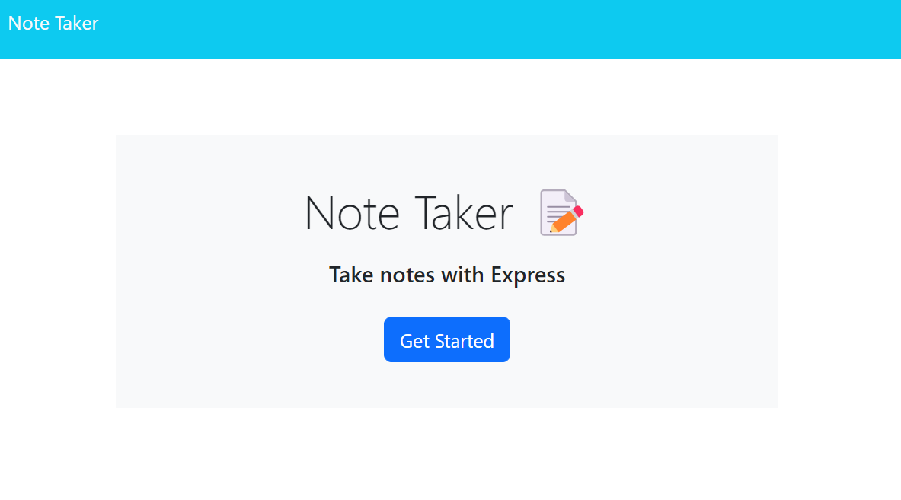

# Note-Taker-App

## Description
```
This project was to use Express.js to create the back-end of a note taker application. 
```

## Requirement Completed:
- Uses Express.js to create backend server
- Persistent notes displayed on page
- Able to generate new notes and save on page

## Depolyed Viewing

Heroku link: https://gator-note-taker-express.herokuapp.com/

GitHub link: https://kawaikimono.github.io/Note-Taker-App/



## Credits
 To Joe and edX Boot Camps LLC for providing material.
